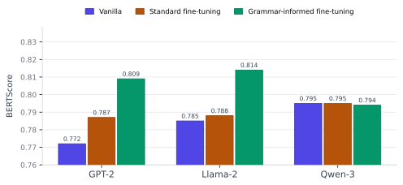
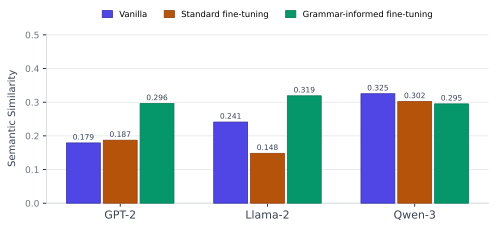
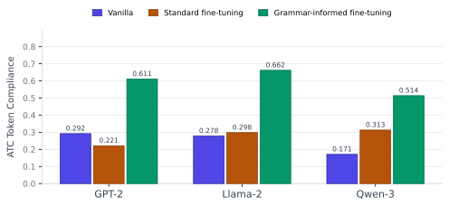

# ATC Chatbot for UAV Operators

An AI-driven communication support system designed to assist **Unmanned Aerial Vehicle (UAV)** operators in navigating controlled airspace. This project fine-tunes causal language models to generate and validate Air Traffic Control (ATC) communications, ensuring compliance with strict aviation protocols.

---

## 📌 Project Overview

Operating UAVs in controlled airspace requires precise adherence to ATC phraseology. This chatbot acts as a bridge, providing real-time communication support. We fine-tuned and compared three architectures:

- **GPT-2** — Lightweight, fast, edge-deployable
- **Llama-2** — Strong semantic understanding
- **Qwen-3** — High vanilla baseline performance

Each model was trained on the **ATC Corpus** dataset using both standard fine-tuning and **grammar-informed** training techniques to improve technical accuracy.

---

## 📊 Evaluation Metrics

Models are evaluated based on four critical performance pillars:

1. **BERTScore** — Evaluates generated text quality against ground truth using contextual embeddings.
2. **Semantic Similarity** — Measures how well the model captures the intent of ATC instructions.
3. **ATC Token Compliance** — A custom metric verifying adherence to standard aviation phraseology and keywords.
4. **Compute Time** — Benchmarks latency to ensure feasibility for real-time deployment.

---

## 🚀 Getting Started

### Installation

Clone the repository and install the required dependencies:

```bash
git clone https://github.com/Purdue-AIDA3/ATC_Chatbot
cd ATC_Chatbot  
pip install -r requirements.txt
```

### Running the Frontend

Set OpenAI key and HuggingFace token in config.json:

```bash
python frontend.py
```

### Training

Replace `[MODEL]` with `GPT`, `LLAMA`, or `QWEN` in the filenames as needed.

**Standard fine-tuning:**

```bash
python train/run_[MODEL]finetune_ATC.py
```

**Grammar-informed fine-tuning:**

```bash
python train/run_[MODEL]finetune_with_Grammar_ATC.py
```

### Evaluation

To run the evaluation suite and generate metrics for a specific model (e.g., GPT):

```bash
python utils/utils_evals_GPT.py
```

---

## 📈 Results and Benchmarks

The table below summarizes model performance on the ATC Corpus. *Grammar* rows refer to models trained with grammar-informed scripts.

| Model | Variant | BERTScore | Semantic Similarity | ATC Token Compliance | Compute Time (avg, mins) |
|---|---|---|---|---|---|
| GPT-2 | Vanilla | 0.772 | 0.179 | 0.292 | — |
| GPT-2 | Standard fine-tuning | 0.787 | 0.187 | 0.221 | 4.12 |
| GPT-2 | Grammar-informed fine-tuning | 0.809 | 0.296 | 0.611 | 4.18 |
| Llama-2 | Vanilla | 0.785 | 0.241 | 0.278 | — |
| Llama-2 | Standard fine-tuning | 0.788 | 0.148 | 0.298 | 8.25 |
| Llama-2 | Grammar-informed fine-tuning | 0.814 | 0.319 | 0.662 | 8.29 |
| Qwen-3 | Vanilla | 0.795 | 0.325 | 0.171 | — |
| Qwen-3 | Standard fine-tuning | 0.795 | 0.302 | 0.313 | 8.27 |
| Qwen-3 | Grammar-informed fine-tuning | 0.794 | 0.295 | 0.514 | 8.33 |

### Charts

> 🟣 Vanilla &nbsp;&nbsp; 🟢 Standard fine-tuning &nbsp;&nbsp; 💚 Grammar-informed fine-tuning

**BERTScore**



**Semantic Similarity**



**ATC Token Compliance**



> To regenerate these charts after updating results, run:
> ```bash
> python docs/generate_charts.py
> ```

### Key Findings

- **ATC token compliance is where it matters most** — Grammar-informed fine-tuning nearly doubles or triples compliance scores across all three models. Standard fine-tuning sometimes makes things *worse*: GPT-2 drops from 0.292 to 0.221 with standard fine-tuning alone.

- **Grammar-informed training consistently wins on semantic similarity** — Llama-2 grammar achieves the best score (0.319), with GPT-2 grammar and Qwen-3 grammar both outperforming their vanilla and standard fine-tuned counterparts.

- **Compliance vs. fluency** — Grammar-informed training increases ATC Token Compliance by enforcing standard phraseology patterns, with only a marginal increase in compute time (e.g., GPT-2: 4.12 → 4.18 mins).

- **Latency and edge deployment** — GPT-2 offers the lowest compute time, making it ideal for edge deployment, while Llama-2 and Qwen-3 require roughly 2× the training time but yield higher semantic similarity scores.

---

## 📂 File Structure

| File / Directory | Description |
|---|---|
| `docs/generate_charts.py` | Regenerates SVG result charts into `assets/` |
| `train/run_[MODEL]finetune_ATC.py` | Scripts for standard supervised fine-tuning |
| `train/run_[MODEL]finetune_with_Grammar_ATC.py` | Scripts incorporating aviation grammar constraints |
| `utils/utils_evals_[MODEL].py` | Evaluation scripts for calculating metrics |
| `docs/` | Generated SVG charts referenced by this README |
| `data/` | Directory for the ATC Corpus dataset |

---

## 🛠 Tech Stack

| Category | Tools |
|---|---|
| Frameworks | PyTorch, Hugging Face Transformers |
| Models | GPT-2, Llama-2, Qwen-3 |
| Dataset | ATC Corpus |
| Visualization | Matplotlib (via `generate_charts.py`) |

---

## 📄 License

Distributed under the MIT License. See [`LICENSE`](LICENSE) for more information.
